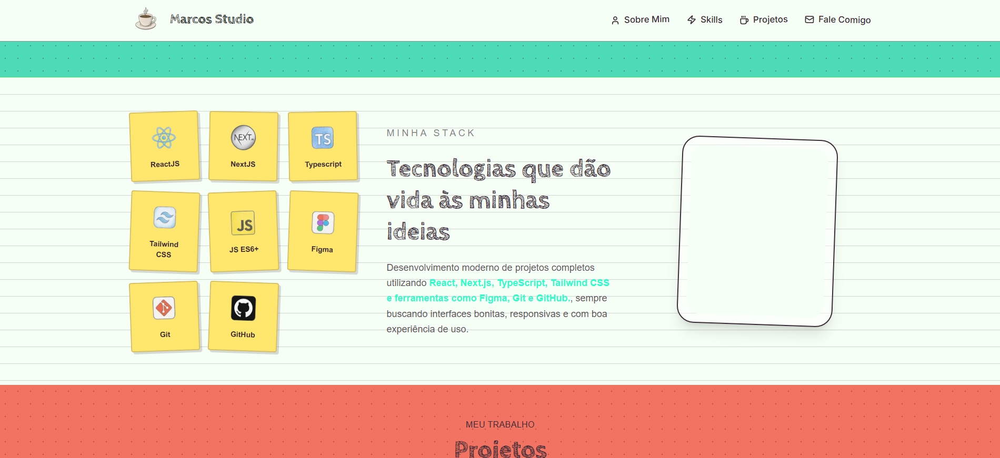

# Marcos Studio ☕

Portfolio pessoal desenvolvido com React, Next.js e TypeScript, focado em apresentar projetos, habilidades e minha abordagem na construção de interfaces modernas.

## Preview



## 💻 Projeto

- [Acesse o projeto finalizado, online](https://marcosstudio.vercel.app)

## 🚀 Tecnologias

- React
- Next.js
- TypeScript
- Tailwind CSS
- Framer Motion
- React Hook Form
- Zod
- Sonner

## 📕 Funcionalidades

✅ Interface responsiva  
✅ Navegação mobile com hamburger menu  
✅ Scroll reveal animations  
✅ Formulário de contato com validação  
✅ Toast feedback visual  
✅ SEO básico (OpenGraph + Twitter Cards)  
✅ UI autoral / identidade visual própria

## Rodando localmente

```bash
git clone ...
cd marcos-studio
npm install
npm run dev
```

## Estrutura do projeto

```txt
src/
 ├── components/
 │   ├── layout/
 │   ├── sections/
 │   ├── templates/
 │   └── ui/
 ├── data/
 ├── schemas/
 └── app/
```

## Autor

Marcos Silva  
Front-End Developer

LinkedIn: https://www.linkedin.com/in/marcos-da-silva-b7766220b  
GitHub: https://github.com/AlbertMagnus011